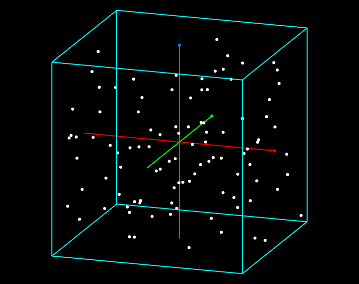

# 3D_Scatter_Plot

Here is the [link](https://KTechi.github.io/3D_Scatter_Plot/).

___Drag & Drop___ sample data (.txt)

## Sample (sample1.txt)

## Command
| Command | Description |
|---------|-------------|
| clear | clear all log |
| hide log | change visibility to 'hidden' |
| show log | change visibility to 'visible' |
